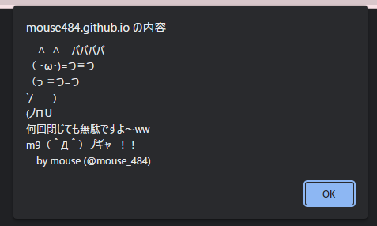

# アラートループ事件
    登壇者:唐澤克幸

---

# 概要

2019年3月
兵庫県警は電子掲示板に**不正プログラムへのリンクを書き込んだ**不正指令電磁的記録供用未遂の疑いで(あくまで設置者は別である)

 * 女子中学生を家宅捜索のち触法少年として補導

 * 男性2人を家宅捜索・書類送検した

3/26には、2018年に男子中学生と男子大学生も摘発されていたことが判明した

---
### これに対し
3月25日、日本ハッカー協会が男性2人の弁護士・裁判費用の援助のための寄付の受付を開始

 * 翌26日
 同団体は計553人の支援者から約700万円の寄付が集まったことを公表し、寄付の受付を終了することを発表

 * 同年5月29日
 男性2人の起訴猶予を理由とした不起訴処分

---
検察側は「ウイルス罪を成立させる要件の1つ『反意図性』に抵触する。そのため男性の行為はウイルス罪に該当する」との認識

そのため、不正指令電磁的記録供用罪に該当するという主張を変えなかった

弁護を担当した弁護士2名が、起訴猶予処分に対し『犯罪にあたると考えるが今回だけは起訴しないでおいた』という姿勢でお茶を濁した」と、検察を批判する声明を発表

---
# プログラム概要

```js
for ( ; ; ) {
window.alert("　∧_∧　ババババ\n（ ・ω・)=つ≡つ\n（っ ≡つ=つ\n`/　　)\n(ノΠＵ\n何回閉じても無駄ですよ～ww\nm9（＾Д＾）プギャー！！")
}
```

これは実際にこの事例で扱われたJavaScriptのソースコードである
ただただアラートループである:thinking:

ソースは解説するまでもなく、JavaScriptを採用したアラートを表示し続けるだけであり、これ単体ではWebサイトに無数にある悪質なアフィリエイトと比べると大した影響はない
(これについてはCoinhive事件などもあげられる)

---

```window.alert```はダイアログを閉じるまでは処理が進まないので、このプログラムはブラウザの動作に影響を与えるものではなく、したがってブラウザクラッシャーではなくジョークプログラムに該当するものである。
かつ**小学生でもわかる**が、これらはタブを閉じる、ウインドウを閉じるなどタスクを終了させてしまえばなんら影響はない

実際に実行すると[これ](https://mouse484.github.io/lets-get-arrested/ja/)が表示されるだけ
 

---

# 反響(ITリテラシーに欠けた人物)
2019年3月5日

スマイリーキクチは補導の報道を受けて、ネット犯罪であることを前提にして
**「中1の少女が簡単にネット犯罪に手を染めてしまう。もうゲーム感覚なんでしょうね。この現実を大人がどのように受け止めればよいのか。。。」** 
と[ツイート](https://archive.fo/9lUgN)し、批判が殺到(推定無罪の原則)

小学生未満のリテラシーであることを自覚した上での発言だと思われるが、それを込みにしても教養が欠けているように感じられる

---

# 反響(有名エンジニアや教授等)

3月6日
JavaScriptの生みの親であるBrendanEichは、
 * [**「Chromeの初版よりも10年も前にリリースされたNetscape 4でもユーザーがループするJavaScriptをキルすることができた。」**](https://twitter.com/BrendanEich/status/1102953296719802369?s=20&t=7Vl3muWeyq2ecWyoAY3Oug)

 * [**「この事件の公判で専門家証人になるつもりでいる。これはウイルスなどではなく、犯罪扱いされるべきではない。もしブラウザがユーザーに制御を取り戻させなかったのならブラウザメーカーを投獄する 」**](https://twitter.com/BrendanEich/status/1104170683045564416?s=20&t=EU2SlJ8REw81YNe2TJ4P7g)
等ツイートした。

---
 ### [BrendanEich](https://ja.wikipedia.org/wiki/%E3%83%96%E3%83%AC%E3%83%B3%E3%83%80%E3%83%B3%E3%83%BB%E3%82%A2%E3%82%A4%E3%82%AF) [Netscape 4](https://ja.wikipedia.org/wiki/Netscape%E3%82%B7%E3%83%AA%E3%83%BC%E3%82%BA)について

**ブレンダン・アイク**
Netscape Communications Corporationに転職後Netscape最高峰ともいえる功績であるJavaScriptの開発に携わった1人

1998年に[mozilla.org](https://www.mozilla.org/ja/)を創設([Firefox](https://www.mozilla.org/ja/firefox/new/)ブラウザの開発元)
2005年にMozilla CorporationにてCTOとなる
現在はBrave Softwareを設立し、[Brave](https://brave.com/ja/)と呼ばれるプライバシー保護に長けたブラウザを開発している

---

**NetScape 4**
Firefoxの前進となったであろうMozilla社のブラウザ
Windows 95普及以前のバージョン3.0をリリースした1996年にはブラウザ全体の70%のシェアを誇っていた
最新版のリリースノートは、
```
Netscape Navigator 4.08 – 1998年11月9日 (16bit版Windowsと68k Macintoshの最終リリース)
```
となっている
つまり，兵庫県警は2000年代ですらない、16bitのコンピュータが主流の時代のブラウザの機能に負けたと煽られたということになる
タイムスリップでもしたのだろうか
**しかし、コレがエンジニア敗戦国の実情なのである**
(Winnyにおいても同じことがいえるが)

---

# [みんなで逮捕されようプロジェクト](https://github.com/hamukazu/lets-get-arrested/blob/master/README.ja.md)
### [#letsgetarrested4jscode](https://twitter.com/search?q=%23letsgetarrested4jscode&src=typed_query)

当時もっともGihubにて盛り上がったリポジトリの1つといって間違いないでしょう
ただの30ヶ国語に翻訳された`README.md`に150を超えるコミット、4000近いStar、1000を超えるForkなどが付きました
このリポジトリの特徴的なところは、これを使って逮捕されれば最良の結果を得られる部分にあります

日本の警察の無能さが世界に示された瞬間だったといえるでしょう

